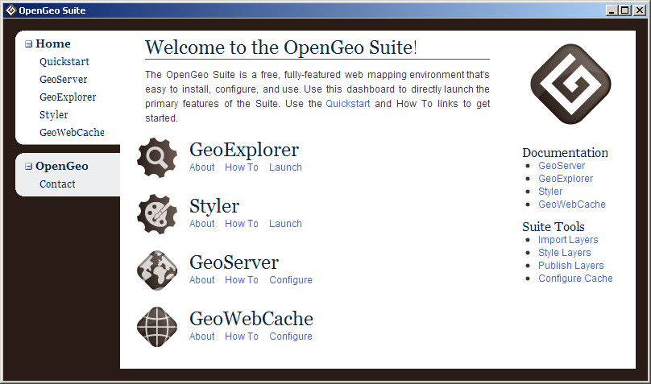
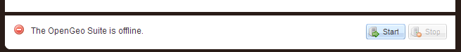
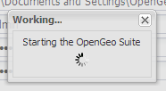
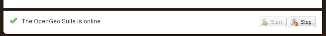

.. _dashboard:

Dashboard
=========

The OpenGeo Suite contains a Dashboard.  This software runs on the host machine (not in a web browser) and contains information about the software as well as convenient links to common tasks.  All links referred to in this guide can be accessed directly from the Dashboard.

   *The OpenGeo Suite Dashboard*

Starting and Stopping
---------------------

The Dashboard can start and stop the OpenGeo Suite service.  Simply click on the Start or Stop button at the bottom right of the Dashboard.  

.. note:: Some links in the Dashboard will be disabled when the OpenGeo Suite is offline.

   *Click to Start the OpenGeo Suite*

   *Starting the service*

   *The OpenGeo Suite service is now online.*

.. note:: You can also start and stop the OpenGeo Suite from the command prompt.  Navigate to the root of your installation directory and run::

      > opengeo-suite start
      > opengeo-suite stop

Preferences
-----------

You can administer the OpenGeo Suite through the Preferences page.

.. warning:: You must stop and start the OpenGeo Suite for any changes to take effect.

.. figure:: img/preferences.png
   :align: center

   *The Preferences page*

Service Ports
~~~~~~~~~~~~~

The OpenGeo Suite runs a web server on your host machine that reponds on a specific port (the default is **8080**).  You can change this by going to the Preferences page and changing the :guilabel:`Port` value.  Click :guilabel:`Save` when done.  Restart the OpenGeo Suite for the change to take effect.

  .. note:: You can also change the Shutdown Port in a similar way.

GeoServer Data Directory
~~~~~~~~~~~~~~~~~~~~~~~~

GeoServer's data and configuration is stored in what is known as the data directory.  By default, this data directory is located in your user's home directory in a directory called ``.opengeo/data_dir``.  You can point the OpenGeo Suite to a different GeoServer data directory if you'd like.  This can be helpful if you are an experienced GeoServer user (or if you'd like to move the data directory elsewhere).  You can change the path by going to the Preferences page and changing the value of :guilabel:`Data Directory`.  Click :guilabel:`Save` when done.  Restart the OpenGeo Suite for the change to take effect.

GeoServer Administration
~~~~~~~~~~~~~~~~~~~~~~~~

Most GeoServer administrative tasks require authentication.  The default username and password for the GeoServer that is contained in the OpenGeo Suite is ``admin`` / ``geoserver``.  To change these credentials, enter new values in the :guilabel:`Username` and :guilabel:`Password` fields.  You will need to type the password in again in the :guilabel:`Confirm` field.  Click :guilabel:`Save` when done.  Restart the OpenGeo Suite for the change to take effect.