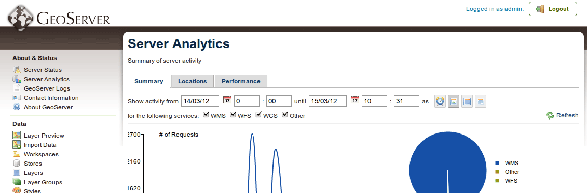

.. _analytics.accessing:

Accessing Analytics
===================

.. note:: Analytics is only available with the Enterprise Edition of the OpenGeo Suite.

The Suite Analytics interface is integrated into the GeoServer web administration interface, which is typically located at ``http://localhost:8080`` by default.  You must be logged into GeoServer using administrator credentials to access Analytics.

Once logged in, the link to access Analytics will be shown on the left side of the page, under :guilabel:`About & Status`, called :guilabel:`Suite Analytics`.  

   *Suite Analytics*

The Analytics interface is divided into three tabs, from which we can review and analyze the activity of our GeoServer:

* :ref:`Summary <analytics.summary>`: Summary of request statuses
* :ref:`Locations <analytics.locations>`: Map of requests by point of origin
* :ref:`Performance <analytics.performance>`: Summary of request speeds and sizes

Subsequent sections will describe the functionality available in each of these tabs.

