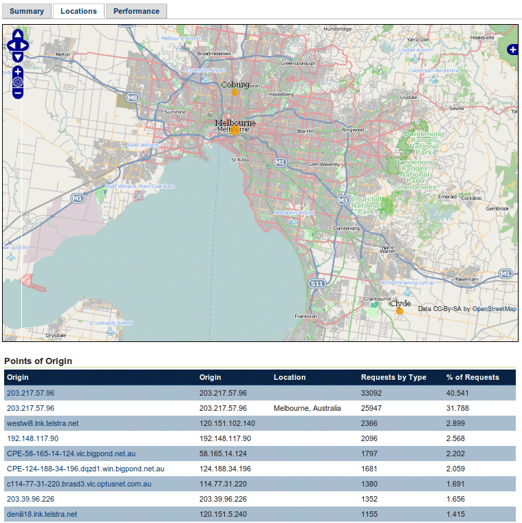
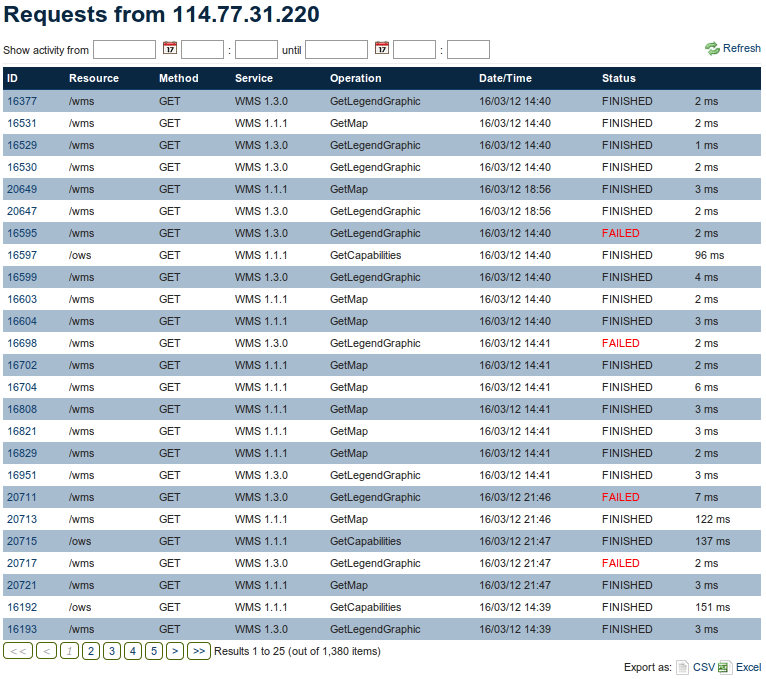

.. _analytics.locations:

Locations tab
=============

.. note:: Geolocation requires additional software.  See the section on :ref:`analytics.geolocation` for more information.

The Locations tab gives administrators a geographical view of the traffic coming to the server (geolocated by IP address).  From this view, one can also retrieve detailed information about individual requests. There are two components to this page:

* The map view, showing each request on the map
* The table view, showing the Points of Origin by IP address, sorted by percentage of requests.

   *Locations tab*

Clicking on an specific point of origin in the table will show a list of individual requests originating from that location.  The information includes the type of resource requested, the OGC service, method, and operation of the request, date/time of the request, status (``FINISHED`` or ``FAILED``), and the request processing time.

   *Requests by IP address*

Clicking on a request ID, displays detailed information about a specific request.  See the :ref:`analytics.summary` section for more about the request information pages.

