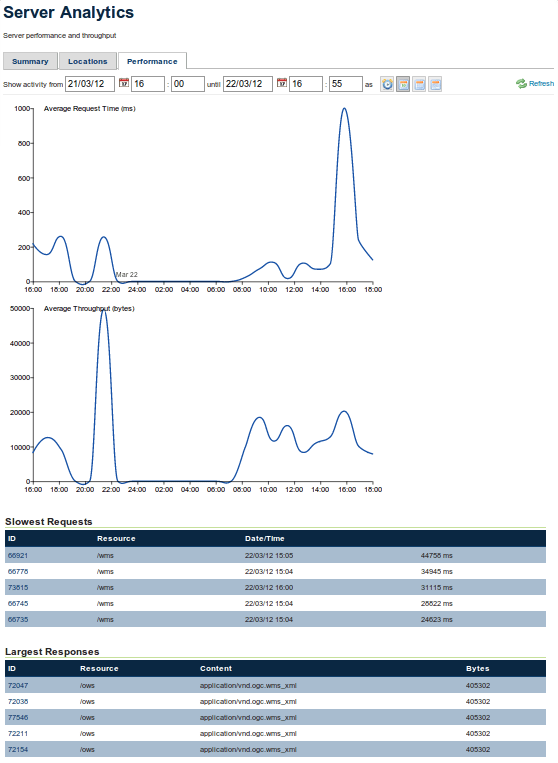

.. _analytics.performance:

Performance tab
===============

The Performance tab displays information regarding the performance of GeoServer.  This view can be used to determine periods of high activity or high latency on the server, and also to identify possible errors or points of improvements in our layer or group layer configuration.

   *Performance tab*

The page contains two graphs, showing the Average Request Time and Average Throughput Time.  The Average Request Time is the average time (in milliseconds) needed for the server to attend all the incoming requests in a given period of time. The Average Throughput is the average volume (in bytes) of information being transferred by the server in a given period of time.

The page also contains a table view, which shows the Slowest Requests and Largest Responses (meaning those responses that required the largest amount of data transfer.

Clicking on the ID of a request in either the Slowest Request table or the Largest Response table will show detailed information about the request.  See the :ref:`analytics.summary` section for more about the request information pages.

