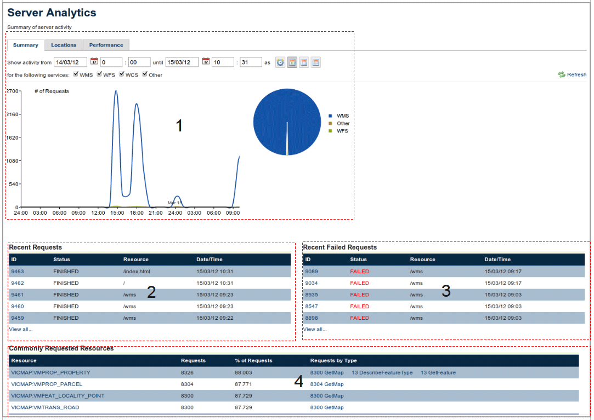
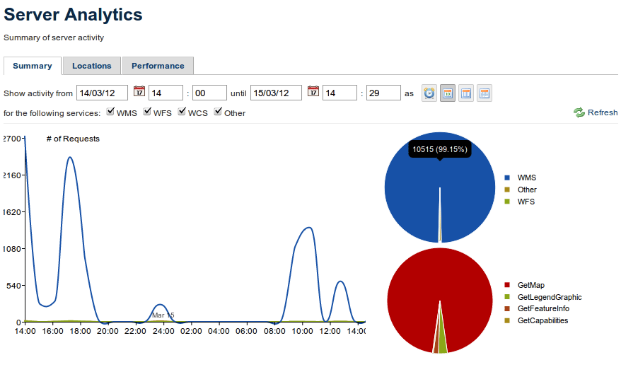
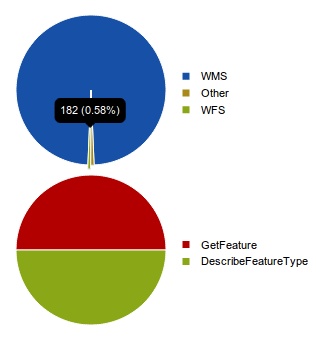
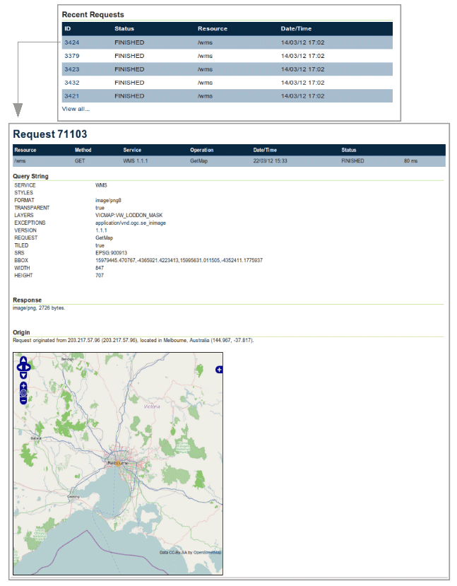
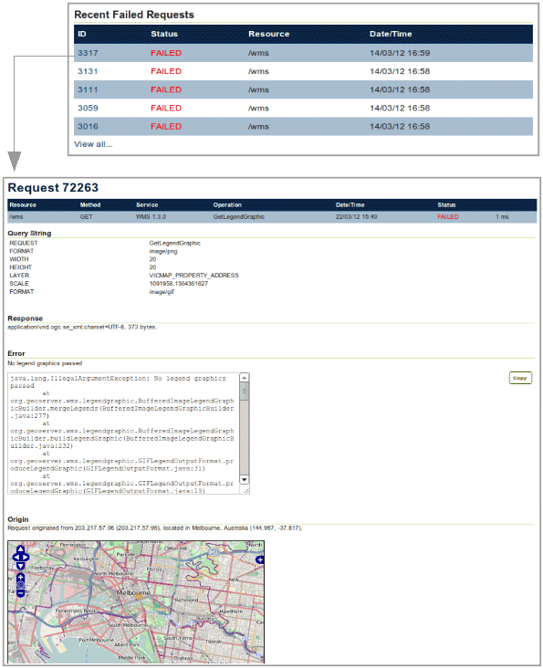

.. _analytics.summary:

Summary tab
===========

The Summary tab shows a high-level overview regarding server requests, specifically their frequency, type, and success or failure.

The Summary page is structured into four components as shown in the figure below:

#. **Server Activity**, which displays request type and quantity over a given period of time.
#. **Recent Requests**, with status and identifiers, plus link to view a full list of requests
#. **Recent Failed Requests**, to notify the administrator of any failing resources.
#. **Commonly Requested Resources**, typically layers.

   *Summary tab*

Server Activity
---------------

The Server Activity section contains a graph showing the amount of requests for a given service over a period of time.  This date/time range can be specified at the top in the query builder.  There is also a pie chart that shows what percentage of the requests were for which services.

   *Server Activity*

Graph
~~~~~

On the given graph, the vertical axis represents the number of requests of each specific OGC web-service specified in the query (sorted by color), and the horizontal axis represents the time range. The precision of the values of the time range can be changed by clicking on the buttons on the top right, which will change the display to be hourly, daily, weekly or monthly.

Charts
~~~~~~

The pie chart shows the percentage of each service requested, such as WFS and WMS, and includes non-OGC services, such as REST and the web interface. Clicking on a particular piece of the pie will display a second chart, detailing the percentage of requested operations for that server (such as GetMap or GetCapabilities).

   *Service and operation charts*

Recent Requests
---------------

The Recent Requests table provides information about each of the requests received by GeoServer, sorted by date/time. The table shows the information sorted by a request ID, and displays status, the specific resource requested, and the date/time when it was requested.

To see more than the five most recent requests, click on :guilabel:`View all...` at the bottom of the table.

Clicking on a particular request ID will display more details about the specific request, including the request parameters, status, response content and size, and origin.

   *Recent requests and request details*

Recent Failed Requests
----------------------

The Recent Failed Requests table provides information about only those requests that have failed in some way.  This could be because a resource was unavailable (such as an incorrect layer name), or server unavailability.  The table, sorted by date/time, shows a unique request ID, and displays status, the specific resource requested, and the date/time when it was requested.

To see more than the five most recent failed requests, click on :guilabel:`View all...` at the bottom of the table.

Clicking on a particular request ID will display more details about the specific failed request, including the error generated by the server and associated stack trace.

   *Recent failed requests and request details*

Commonly Requested Resources
----------------------------

The Commonly Requested Resources table displays the most commonly accessed layers in GeoServer, sorted by number of requests, and including the specific request operation (GetMap, DescribeFeatureType, etc.)

   .. figure:: img/commonresources.png
      :align: center

      *Commonly Requested Resources*

Clicking on an specific resource in this table will display a graph and details about the requests for that particular resource.  The information shown is very similar to the main Server Activity area with its associated graphs and charts as mentioned above, but is specific to only the resource. 

   .. figure:: img/resourceinfo.png
      :align: center

      *Resource request details*

Clicking on the a link in the Request by Type column will display the full list of requests for a given method/operation, ordered by request ID.  The table shows the service, method, date/time of request, status, plus the time needed to complete the request in milliseconds.

   .. figure:: img/requestsbytype.png
      :align: center

      *Requests by type*

